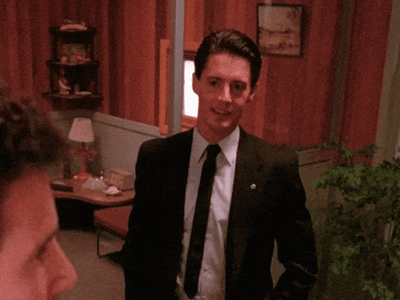

Olá, meu nome é Ynara Castro, tenho 26 anos e sou natural de São Luís, Maranhão, Brasil.

Atualmente sou pós-graduanda em Meteorologia com foco em *Climatologia* e *Interação Oceano-atmosfera*, pela Universidade Federal de Pelotas. Tenho interesse por *Analise de Dados* e *Desenvolvimento de Sistemas*, explorando ferramentas que conectam ciência e tecnologia.

Obrigada por visitar o meu perfil :)

Meu Linkedin - https://www.linkedin.com/in/ynara/

#Obrigada!

